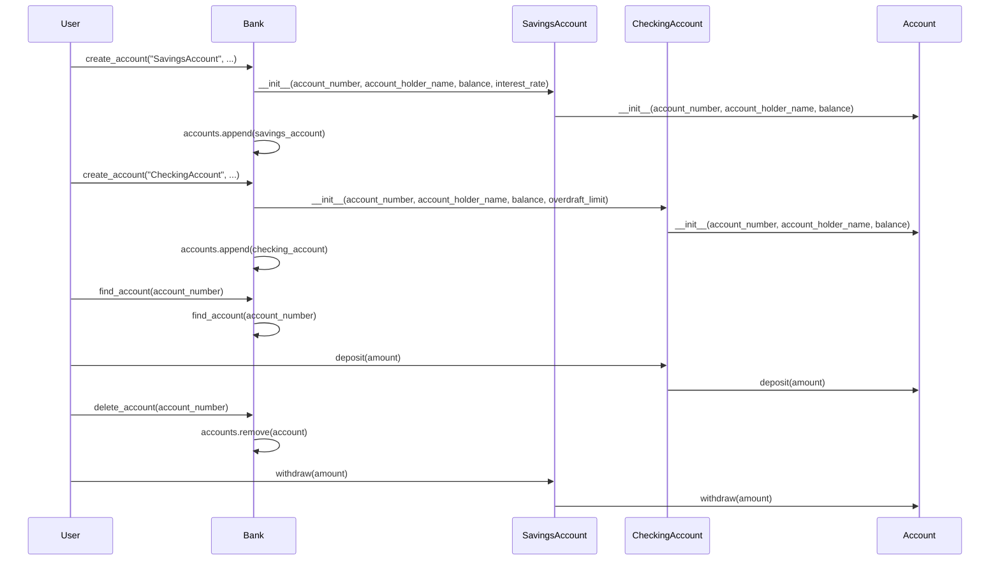

# UML Sequence Diagram

UML Sequence Diagram includes the following interactions:
* Creating a Savings account
* Creating a Checking account
* Depositing to a Checking account
* Withdrawing from a Savings account

